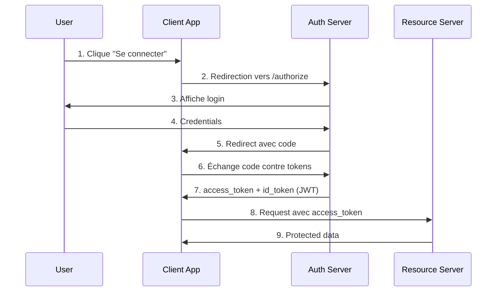

## Introduction

Le problème avec l'auth, c'est que tout le monde utilise les acronymes sans comprendre

```mermaid
sequenceDiagram
    participant User
    participant Client as Client App
    participant Auth as Auth Server
    participant API as Resource Server

    User->>Client: 1. Clique "Se connecter"
    Client->>Auth: 2. Redirection vers /authorize
    Auth->>User: 3. Affiche login
    User->>Auth: 4. Credentials
    Auth->>Client: 5. Redirect avec code
    Client->>Auth: 6. Échange code contre tokens
    Auth->>Client: 7. access_token + id_token (JWT)
    Client->>API: 8. Request avec access_token
    API->>Client: 9. Protected data
```
